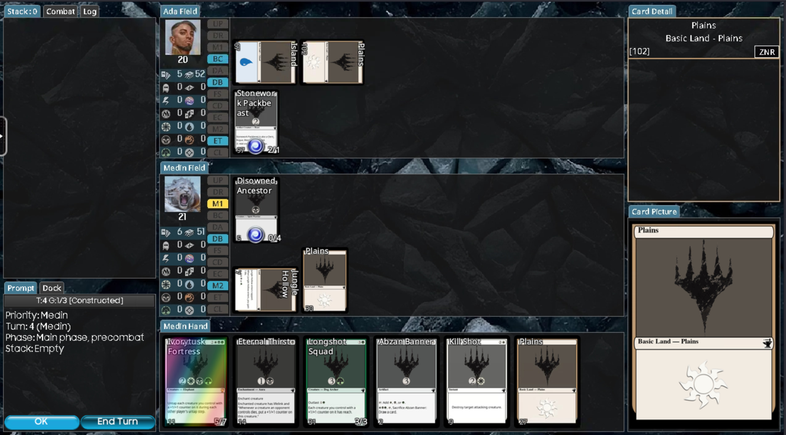

(Card) Forge for private (remote) use
=====================================

**Fight goblins, not unwelcome guests!**


Private (Card)Forge rdesktop environment using [Tailscale](https://tailscale.com). 
This is imported from `gbraad-gaming/personal-cardforge` but provides a more generic image.




## Usage instructions

```shell
$ podman run -d --name cardforge \
   --hostname ${HOSTNAME}-cardforge -p 8444:8444 \
   -v ~/.cache/forge:/home/forge/.cache/forge \
   ghcr.io/spotsnel-gaming/cardforge:latest
$ podman exec -it cardforge su - forge
$ kasmvncserver
```

This allows you to open the remote session from your IP, like
`https://[remote_ip]:8444`. 

> [!NOTE]
> Username: `forge`  
> Password: `password`

Otherwise, you can use tailscale to allow remote use:

```shell
$ sudo tailscale up
$ tailscale ip
```

... and then open `https://[tailscale_ip]:8444`

### Devcontainer

A devcontainer is available for testing purposes. While it starts, the kasmvnc server
can not be used on localhost. Preferably the following can be done

As `root`
```
$ tmux new-session -s tailscaled -d
$ tmux send -t tailscaled "tailscaled" ENTER
$ tailscale up
```

and then use another user:
```
$ su - forge
$ kasmvncserver
$ tailscale ip
```

... and then open `https://[tailscale_ip]:8444`


### Actions

It is also possible to run a remote instance on Actions, by adding a Tailscale authentication key in the repository secrets named `TAILSCALE_AUTHKEY` and start the `tailscale-rdesktop` workflow.

```
$ gh workflow run tailscale-rdesktop.yml
```

## Author

| [](http://gbraad.nl "Gerard Braad <me@gbraad.nl>") |
|---|
| [@gbraad](https://gbraad.nl/social)  |


### Sponsor
Become a patron or sponsor, by simply clicking one of these buttons

[](https://www.patreon.com/gbraad)

[](https://github.com/sponsors/gbraad)

... or consider a small one-time donation to show appreciation

[](https://www.buymeacoffee.com/gbraad)

[](https://www.paypal.com/cgi-bin/webscr?cmd=_donations&business=me%40gbraad%2enl&lc=US&item_name=gbraad&currency_code=USD&bn=PP%2dDonationsBF%3abtn_donate_SM%2egif%3aNonHosted)
